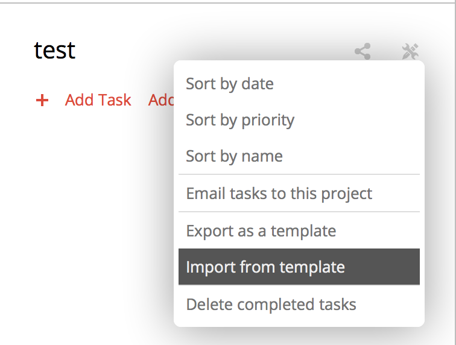

# Todoist Template for Guide to Technical Development
[Google's Guide to Technical Development](http://www.google.com/about/careers/students/guide-to-technical-development.html) formatted as a Todoist template

### Install
* Download the text file
* Open Todoist
* Create new Project
* Edit the Project using the settings icon
* Choose Import from Template
* Profit

